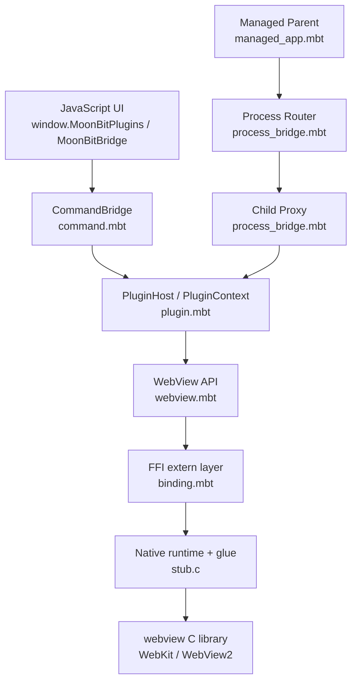
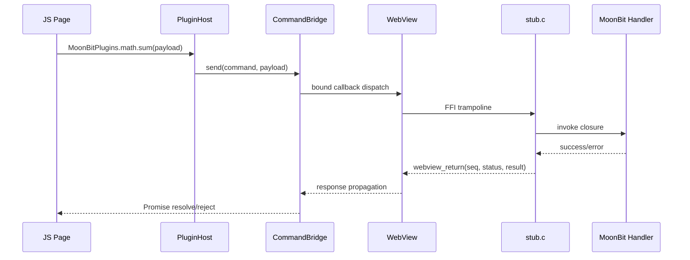

# Lepus WebView

`lepus-apps/webview` is a MoonBit-native desktop framework built on top of the
[`webview`](https://github.com/webview/webview) C library. It provides a typed,
plugin-oriented bridge between MoonBit logic and embedded web UI, plus optional
multi-process routing for parent/child window architectures.

## Highlights

- Native desktop windows backed by WebKit (macOS/Linux) or WebView2 (Windows)
- Typed JS <-> MoonBit command bridge
- Plugin runtime with namespaced command registration
- Event push channel from MoonBit to JavaScript
- Parent/child process command routing and IPC abstractions
- Native FFI layer with explicit ownership annotations

## Repository Layout

```text
lepus_webview/
├── binding.mbt          # Low-level extern declarations (MoonBit <-> C)
├── command.mbt          # Command bridge protocol and dispatch
├── plugin.mbt           # PluginHost / PluginContext APIs
├── process_bridge.mbt   # Process command request/response wire protocol
├── managed_app.mbt      # Parent-child process orchestration
├── webview.mbt          # Public WebView API
├── window_manager.mbt   # Window manager and IPC wrappers
├── stub.c               # Native stub runtime and platform adaptation
├── moon.mod.json        # Module metadata
├── moon.pkg             # Build targets, native stub, link options
├── lib/                 # Prebuilt shared libraries
├── example/             # Runnable demo app
└── tests/               # Test package
```

## Architecture



## Command Flow



## Core Components

### `WebView` (`webview.mbt`)

`WebView` is the main runtime abstraction for window lifecycle and JS integration.
It wraps the native webview handle and exposes APIs such as `run`, `destroy`,
`bind`, `unbind`, `eval`, `init`, `set_html`, `navigate`, and `response`.

### `CommandBridge` (`command.mbt`)

`CommandBridge` implements the base JS <-> MoonBit RPC protocol:

- JS invokes `window[global].send(name, payload)`
- MoonBit handlers decode payload and return typed replies
- MoonBit can push events back to JS listeners

### `PluginHost` (`plugin.mbt`)

`PluginHost` builds a namespaced command surface on top of `CommandBridge`:

- Register commands per plugin via `PluginContext`
- Expose plugin APIs under `window.MoonBitPlugins[plugin][api]`
- Emit plugin-scoped events to JS subscribers

### `Process Bridge` (`process_bridge.mbt`, `managed_app.mbt`)

Used for parent/child process execution models. Current response wire format:

- success: `{"status":"ok","payload":...}`
- failure: `{"status":"error","error":"..."}`

## JavaScript Protocol

- Plugin command name format:
  - `plugin:"<plugin_name>":"<api_name>"`
- All cross-boundary names are JSON-quoted before script injection
- JS API surface:
  - `window.MoonBitBridge.send(name, payload)`
  - `window.MoonBitPlugins[plugin][api](payload)`
  - `window.MoonBitPlugins[plugin]["@@on"](...)`
  - `window.MoonBitPlugins[plugin]["@@onEvent"](...)`

## Build and Run

### Prerequisites

- MoonBit toolchain (`moon`)
- Native `webview` shared libraries available under `lib/`

### Commands

```bash
# Type-check
moon check

# Run tests
moon test --target native

# Build
moon build --target native

# Run demo
moon run --target native example

# Regenerate package interface
moon generate-interface
```

## Platform Notes

- Native target only (`supported_targets = "+native"`)
- No WASM target support
- macOS/Linux use linker flags such as `-Llib -lwebview -Wl,-rpath,lib`
- Windows uses `webview.dll` + `webview.lib` and `_WIN32` adaptations in `stub.c`

## FFI and Ownership Model

- `binding.mbt` remains a thin extern declaration layer
- Ownership annotations follow MoonBit FFI semantics:
  - `#borrow(param)` for call-scoped use
  - `#owned(param)` when C side retains ownership
- C-owned MoonBit objects must be released with `moonbit_decref` in native code

## Development Guidelines

- Keep business logic out of `binding.mbt`; implement glue in `stub.c`
- Prefer typed command handlers over ad-hoc JSON parsing in application code
- Use `abort(...)` for invariants and explicit error responses for recoverable failures
- Maintain strict namespacing for plugin APIs and injected JS globals

## License

Apache-2.0
