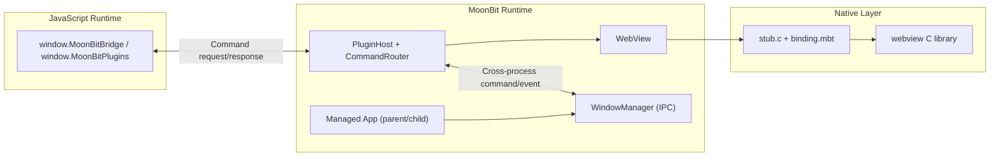

# Lepus WebView

`lepus-apps/webview` is a MoonBit-native desktop framework built on top of
[`webview`](https://github.com/webview/webview). It provides:

- Native windows (`WebKit` / `WebView2`)
- Typed JS <-> MoonBit bridge
- Plugin-style command routing
- Parent/child process IPC APIs

## Architecture



## API List

API list below is aligned with [`pkg.generated.mbti`](/Users/luoyuhang.22/Code/lepus-apps/lepus_webview/pkg.generated.mbti).

### `WebView`

- Lifecycle: `destroy`, `terminate`
- Window/UI: `set_title`, `set_size`, `set_html`, `navigate`
- Window controls: `minimize`, `maximize`, `unmaximize`, `toggle_maximize`, `set_fullscreen`, `toggle_fullscreen`, `close`
- Window customization: `set_window_customization`, `enable_custom_titlebar_support`, `enable_transparent_background_support`
- History: `back`, `forward`, `go`, `reload`, `reload_force`
- Handle: `get_handle`

### `Window` (Managed App)

- Setup: `new`, `install`, `set_html`, `navigate`
- Window controls: `minimize`, `maximize`, `unmaximize`, `toggle_maximize`, `set_fullscreen`, `toggle_fullscreen`, `close`
- Window customization: `set_window_customization`
- History: `back`, `forward`, `go`, `reload`, `reload_force`
- Run: `run`

### `Plugin` / `PluginHost` / `PluginContext`

- Plugin build/install: `Plugin::new`, `PluginInternal::new`, `PluginHost::new`, `PluginHost::install`, `PluginHost::destroy`
- Context handlers: `command_async`, `command_result_async`, `command_result_bg`
- Bridge access: `PluginHost::command_bridge`, `PluginHost::global_name`

### Process Command IPC

- Request/response model: `ProcessCommandRequest`, `ProcessCommandResponse`
- Router: `ProcessCommandRouter::{new, handle, handle_async, handle_result, handle_result_async, dispatch, serve, plugin}`
- Proxy: `ProcessCommandProxy::{new, call, call_plugin, plugin_handler}`
- Plugin router: `ProcessPluginRouter::{command, command_async, command_result, command_result_async}`

### Window Manager IPC

- Process control: `init`, `fork_process`, `spawn_process`, `connect_child_process`
- Window control: `create_window`, `create_child_window`, `run_window`, `destroy_window`, `destroy`, `set_window_customization`, `minimize_window`, `maximize_window`, `unmaximize_window`, `toggle_maximize_window`, `set_fullscreen_window`, `toggle_fullscreen_window`, `close_window`
- Messaging: `send_message`, `broadcast`, `request`, `respond`, `try_pop_message`
- Process-command serving: `serve_process_commands`
- State: `is_main_process`, `is_child_process`, `wait_child_noblock`

## Window Customization

`Window::new(...)` and `WebView::new_managed(...)` support:

- `frameless : Bool`
- `resizable : Bool`
- `always_on_top : Bool`
- `transparent : Bool`
- `title_bar_style : Int` (`0` default, `1` hidden)
- `title_bar_overlay : Bool`

Constants:

- `@webview.TITLE_BAR_STYLE_DEFAULT`
- `@webview.TITLE_BAR_STYLE_HIDDEN`

### Drag Region (`-webkit-app-region: drag`)

For custom title bars, Lepus injects drag helpers automatically when one of the
following is true:

- `frameless = true`
- `title_bar_style = TITLE_BAR_STYLE_HIDDEN`
- `title_bar_overlay = true`

You can mark draggable and interactive regions with:

- draggable: `.lepus-drag`, `.lepus-titlebar`, `[data-lepus-drag="true"]`
- non-draggable: `.lepus-no-drag`

You can also use raw CSS directly:

```css
.titlebar {
  -webkit-app-region: drag;
}
.titlebar button {
  -webkit-app-region: no-drag;
}
```

## Example

Run the included demo:

```bash
moon build --target native example
moon run --target native example
```

Minimal managed-window example:

```moonbit nocheck
///|
fn main {
  let win = @webview.Window::new(title="Lepus WebView", width=960, height=640)
  win.set_html("<html><body><h1>Hello from MoonBit</h1></body></html>")
  win.run()
}
```

## Build & Test

```bash
moon check
moon test --target native
moon build --target native
```

## License

Apache-2.0
